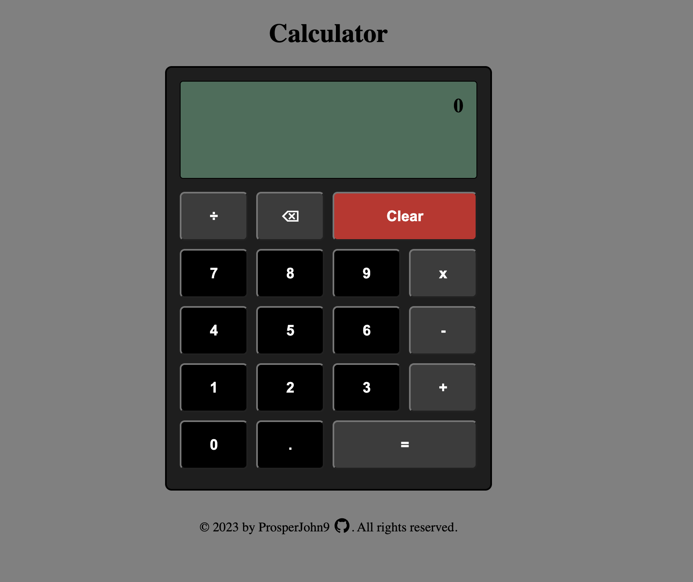

# Calculator
Calculator made with HTML, CSS and JavaScript.

Live Demo: 
https://prosperjohn9.github.io/calculator

Desktop View:

This project was created for the Calculator assignment as part of The Odin Project curriculum.

#Objectives
1. Function for each math operator
2. Operator function that takes an operator and calls one of previous functions
3. Display with button for each digit, operation function, 'clear', and 'equals'
4. Functions to populate display
5. String multiple operations together (2 + 3 - 1.5 * 9 = 42)
6. Do not evaluate more than one pair of numbers at a time
7. Round long decimal numbers to avoid overflow
8. Clear all values when clicking on clear
9. Error message for divide-by-zero
10. Decimal button for floating point numbers
11. Different colors for operation and number buttons
12. "Backspace" button for wrong entries

